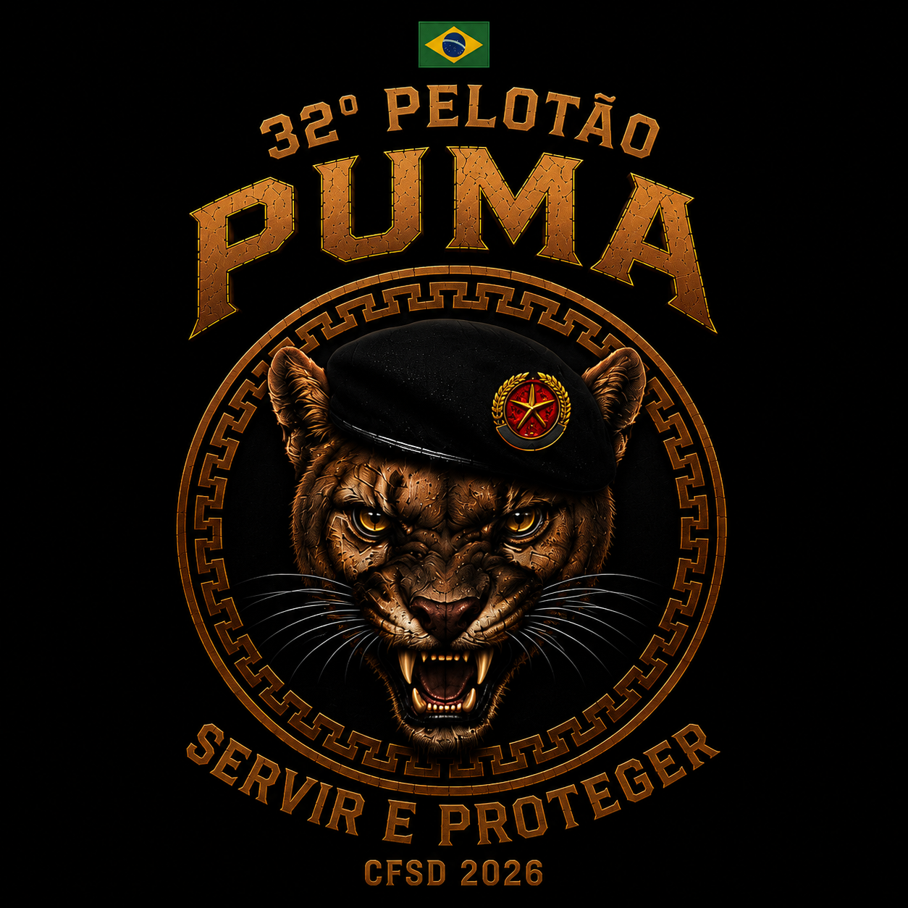

# Sistema PUMA - Treinamento Tático & Gamificação Policial (PMCE)

<div align="center">
  
  <h3>32º Pelotão do Curso de Formação de Oficiais / Praças — Polícia Militar do Ceará</h3>
  <p><strong>Plataforma Web Avançada de Simulados ao Vivo, Inteligência Artificial e Mentor Tático</strong></p>
</div>

---

Bem-vindo ao **Sistema PUMA**, uma plataforma de treinamento tático de precisão desenvolvida sob medida para a preparação de policiais e turmas de concurso de alto nível da **Polícia Militar do Ceará (PMCE)**. 

O sistema combina dinâmicas de sala de aula em tempo real (via WebSockets), **Inteligência Artificial Generativa (Google Gemini)** com análise comportamental e um robusto sistema de **Gamificação Militar com Brevês de Honra**, projetados para simular a pressão real de combate, treinar a tomada de decisão sob estresse e monitorar o tempo de reação de cada recruta milissegundo a milissegundo.

---

## 🚀 Destaques & Diferenciais Operacionais

### 🛡️ Identidade Visual & Glassmorphism Tático
- **Estética Militar Premium:** Interface escurecida (*Dark Mode*) moderna, com acentos em âmbar dourado e verde esmeralda, bordas luminosas e sombras dinâmicas.
- **Brasão PUMA Fundido (`mix-blend-screen`):** A identidade do **32º Pelotão PUMA** integra-se perfeitamente às barras de navegação superior e telas de autenticação, eliminando fundos sólidos e proporcionando um visual tecnológico de centro de comando.
- **Responsividade Total:** Adaptado perfeitamente para telões de projetor em sala de aula, notebooks dos instrutores e smartphones dos combatentes em campo.

---

### 🤖 Inteligência Artificial Integrada (Google Gemini)
- **Geração Automática de Simulados por PDF:** Faça o upload de apostilas, leis, Vade Mecum ou manuais em PDF. A IA realiza a leitura integral do material e extrai questões com enunciado, 5 alternativas (`A` a `E`) e justificativa técnica embasada na doutrina.
- **Mentor Policial IA (`/aluno/chat`):** Uma IA interativa treinada com jargões militares e conhecimento jurídico/policial que orienta o aluno, responde dúvidas com base no conteúdo integral das apostilas ativas e aconselha sobre como corrigir deficiências nos simulados recentes.
- **Análise Comportamental Diária (`/api/aluno/analysis`):** Geração de relatórios automáticos 1x ao dia (com cache de dados em banco para economia de tokens), avaliando a precisão de disparo, tempo de reação e consistência tática do militar.
- **Alta Disponibilidade com Fallback Duplo:** Sistema equipado com chave principal (`GEMINI_API_KEY`) e chave reserva (`GEMINI_API_KEY_FALLBACK`) para alternância automática em caso de instabilidade momentânea da API.

---

### 👨‍✈️ Centro de Comando do Instrutor (`/instructor`)
- **Controle de Sala Ao Vivo (`LIVE`):** Comande a progressão da turma como um mestre de sala. Avance questões, pause o tempo, anule itens controversos, encerre missões antecipadamente e projete o gabarito no telão principal com estatísticas de erro/acerto em tempo real.
- **Roleta Tática (Sorteio de Alvo):** Ative o modo "Sorteio" durante o simulado para escolher aleatoriamente um único recruta que deverá responder a questão perante todo o pelotão. A pontuação é computada com exclusividade, garantindo que a taxa global dos demais alunos permaneça intacta e justa.
- **Gestão de Vagas e Pelotão (Vaga 01 a 34+):** Cadastro ágil de alunos identificados por número de capacete/vaga no pelotão e nome de guerra (QRA).
- **Dossiê Operacional & Redefinição Rápida de Senhas:** Acesso a relatórios de desempenho individual, histórico completo de respostas, suspensão disciplinar temporária e redefinição instantânea de senha (com senha padrão `PMCE123` ou personalizada).
- **Pódio e Relatórios Analíticos:** Exibição celebrativa do **Top 3 Combatentes** ao final do simulado e visão geral de aproveitamento da turma em cada alternativa.

---

### 🪖 Quartel General do Aluno (`/aluno/painel`)
- **Dashboard de Estatísticas Vitais:** Monitoramento claro dos 4 pilares operacionais:
  1. **Total de Simulados Concluídos:** Contagem de missões finalizadas com êxito.
  2. **Taxa Global de Acertos (`Accuracy`):** Aproveitamento geral do militar calibrado com rigor matemático.
  3. **Pontos Totais:** Acúmulo de pontuação por acerto rápido e missões especiais.
  4. **Tempo Médio de Reação:** Média de segundos gastos para análise e disparo por questão.
- **Missões do Dia & Simulados de Estudo (`SELF_PACED`):** Listagem de missões com identificação nítida da apostila de origem em duas linhas visíveis, facilitando a escolha da bateria de exercícios.
- **Mural de Brevês (Gamificação Militar):** Conquiste medalhas e distinções de mérito ao atingir metas de alto desempenho no campo de batalha virtual:
  - 🏅 **Recruta Padrão:** Concedido ao concluir os primeiros passos no sistema.
  - 🛡️ **Veterano de Combate:** Concluídos pelo menos 10 simulados no sistema.
  - 🎯 **Atirador de Elite (Sniper):** Atingir 100% de precisão em um simulado com 20 ou mais questões.
  - ⚡ **Pronto Resposta (Raio):** Acerto $\ge 85\%$ com tempo médio de reação $\le 15\text{s}$ em simulado de 15+ questões.
  - 🌟 **Padrão PM:** Acumular 150.000 pontos e manter taxa global de acertos $\ge 92\%$.
  - 💀 **Caveira:** Concluir no mínimo 40 simulados avançados com taxa global de acertos $\ge 97\%$ e 100.000+ pontos.
- **Proteção Dupla contra Tiros Acidentais:** Mecanismo de confirmação em duas etapas para seleção de alternativas em dispositivos móveis ou telas touch, impedindo cliques involuntários sob pressão.

---

### ⚖️ Calibragem e Justiça Matemática (Taxa Global)
O sistema opera sob a diretriz estrita de que **a Taxa Global de Acertos (`Accuracy`) computa exclusivamente os alvos de simulados 100% concluídos**. 
- Simulados que ainda estão em andamento, missões abandonadas ou salas ao vivo encerradas prematuramente pelo instrutor sem que o aluno tenha respondido a totalidade das questões são automaticamente desconsiderados no denominador da fórmula, impedindo quedas injustas na nota e no histórico do combatente.

---

## 🛠️ Stack Tecnológica & Arquitetura

O Sistema PUMA é construído sobre uma arquitetura moderna, escalável e de baixa latência:

| Camada | Tecnologia | Descrição |
| :--- | :--- | :--- |
| **Framework Web** | [Next.js 15+](https://nextjs.org) (`App Router`) | Full-stack React com Server Components e Server Actions |
| **Linguagem** | [TypeScript 5+](https://www.typescriptlang.org) | Tipagem estática rigorosa para estabilidade do código |
| **Tempo Real** | [Socket.io](https://socket.io) (`server.ts`) | WebSockets para sincronização instantânea de salas ao vivo |
| **Banco de Dados & ORM** | [Prisma ORM](https://www.prisma.io) + SQLite / PostgreSQL | Abstração relacional robusta e type-safe |
| **Estilização** | [Tailwind CSS](https://tailwindcss.com) + `shadcn/ui` | Design system moderno com Dark Mode e animações customizadas |
| **Inteligência Artificial** | [Google Generative AI](https://ai.google.dev) (`Gemini 3.5 Flash`) | Processamento de linguagem natural e geração de simulados via PDF |
| **Ícones & UI** | [Lucide React](https://lucide.dev) | Biblioteca de ícones vetoriais modernos e leves |

---

## ⚙️ Instalação & Execução Local

Siga o passo a passo abaixo para rodar o ambiente de desenvolvimento local em sua máquina ou servidor:

### 1. Pré-requisitos
- **Node.js** (versão 18, 20 ou superior)
- **NPM** ou **Yarn**

### 2. Instalação de Dependências
Clone o repositório e instale os pacotes no terminal:
```bash
git clone https://github.com/Fezudo98/Sistema-PUMA.git
cd "sistema pmce"
npm install
```

### 3. Configuração do Ambiente (`.env`)
Crie o arquivo `.env` na raiz do projeto contendo as chaves da API e a URL do banco:
```env
# Chaves da API do Google Gemini (IA)
GEMINI_API_KEY="SUA_CHAVE_PRINCIPAL_AQUI"
GEMINI_API_KEY_FALLBACK="SUA_CHAVE_RESERVA_AQUI"

# Conexão com o Banco de Dados (SQLite local ou PostgreSQL)
DATABASE_URL="file:./dev.db"
```

### 4. Sincronização e Carga Inicial do Banco de Dados
Sincronize o schema do Prisma e crie o arquivo local do banco:
```bash
npx prisma db push
```
*(Opcional)* Para povoar o banco com dados de teste e usuários iniciais:
```bash
npx ts-node populate_dummy_data.ts
```

### 5. Inicialização do Servidor (com WebSockets)
Para rodar o sistema em modo de desenvolvimento ativando o servidor customizado `server.ts` junto ao Socket.io:
```bash
npm run dev
```
> *Alternativa Prática (Windows):* Dê um duplo clique no script `Iniciar sistema.bat`.

### 6. Acesso à Plataforma
Abra seu navegador no endereço:
- **URL Padrão:** `http://localhost:3000`

---

## 📋 Guia de Operação e Dicas Táticas

- **Credenciais Iniciais:**
  - **Instrutor Padrão:** Cadastrado com a credencial de oficial/instrutor (`role: INSTRUCTOR`).
  - **Alunos do Pelotão (Vagas 01 a 34+):** Cadastrados no painel do instrutor (`role: STUDENT`), acessando via `/aluno` com CPF ou código de vaga e senha.
- **Redefinição Rápida de Senha:** Caso o militar esqueça sua senha de acesso, o Instrutor pode acessar a aba **Combatentes**, clicar em **Ver Dossiê** e acionar o botão de redefinição para a senha padrão (`PMCE123`) em 1 segundo.
- **Recuperação de Senha do Instrutor:** Se necessário, a credencial do instrutor pode ser ajustada via terminal utilizando o painel visual do Prisma Studio:
  ```bash
  npx prisma studio
  ```
- **Atualização em VPS / Produção (PM2):**
  Para atualizar o servidor de produção remotamente após novos commits:
  ```bash
  cd /var/www/puma && git pull origin main && npm run build && pm2 restart puma
  ```

---

<div align="center">
  <p><strong>32º Pelotão PUMA — Curso de Formação PMCE</strong></p>
  <p><em>"Treinamento duro, combate fácil. Força e Honra!"</em> 👮‍♂️🗡️</p>
</div>
