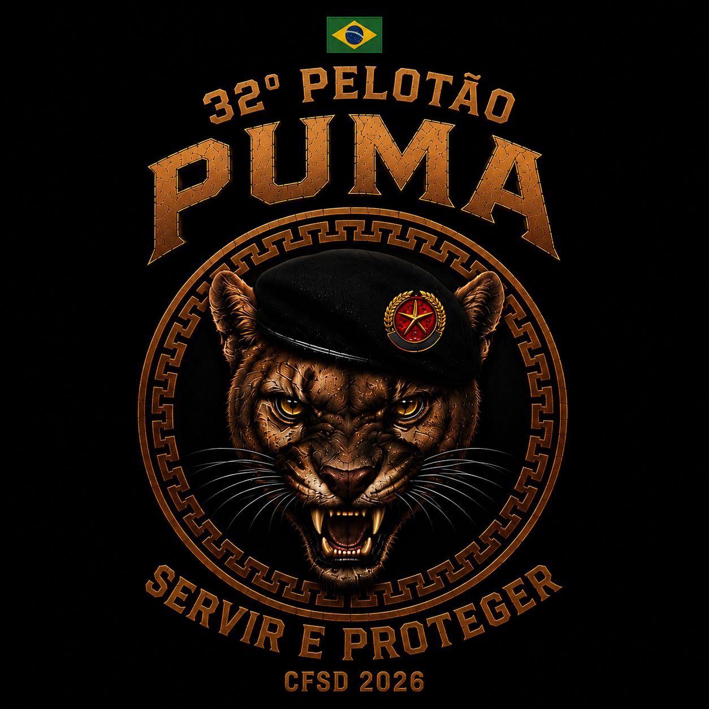

# Sistema PUMA - Treinamento Tático & Gamificação Policial (PMCE)

<div align="center">
  
  <h3>32º Pelotão do Curso de Formação de Oficiais / Praças — Polícia Militar do Ceará</h3>
  <p><strong>Plataforma Web Avançada de Simulados ao Vivo, Inteligência Artificial e Gamificação Tática</strong></p>
</div>

---

Bem-vindo ao **Sistema PUMA**, uma plataforma de treinamento tático de precisão desenvolvida sob medida para a preparação de policiais e turmas de concurso de alto nível da **Polícia Militar do Ceará (PMCE)**. 

O sistema combina dinâmicas de sala de aula em tempo real (via WebSockets), **Inteligência Artificial Generativa (Google Gemini)** com análise comportamental e um robusto sistema de **Gamificação Militar, Brevês de Honra e Fardamentos Visuais**, projetados para simular a pressão real de combate, treinar a tomada de decisão sob estresse e monitorar a evolução tática de cada recruta.

---

## 🚀 Destaques & Diferenciais Operacionais

### 🛡️ Identidade Visual, Glassmorphism & Microanimações Premium
- **Estética Militar Avançada:** Interface responsiva com opções de *Modo Claro*, *Modo Escuro (Padrão)* e fardamentos visuais desbloqueáveis.
- **Tema Tático (RAIO ⚡):** Ao desbloquear e ativar o tema RAIO, o sistema passa por um *override* completo de CSS (variáveis Táticas), adotando a paleta Ouro e Preto do Batalhão de Policiamento de Rondas de Ações Intensivas e Ostensivas.
- **Efeitos Procedurais (Canvas WebGL):** Transição de temas turbinada com um algoritmo procedural em HTML5 Canvas que gera **relâmpagos ramificados ultra-realistas** caindo pela tela, acompanhados de um clarão estroboscópico e a sobreposição do Brasão Oficial do RAIO.
- **Responsividade Total (Mobile-First):** Layouts fluidos adaptados perfeitamente para telões de projetor em sala de aula, notebooks dos instrutores e touchscreens dos combatentes em campo.

---

### 🤖 Inteligência Artificial Integrada (Google Gemini)
- **Geração Automática de Simulados por PDF:** Faça o upload de apostilas, leis, Vade Mecum ou manuais em PDF. A IA realiza a leitura integral do material e extrai questões complexas com enunciado, alternativas e justificativa técnica embasada na doutrina.
- **Mentor Policial IA (`/aluno/chat`):** Uma IA interativa treinada com jargões militares e conhecimento jurídico/policial que orienta o aluno, responde dúvidas com base no conteúdo integral das apostilas ativas e aconselha sobre como corrigir deficiências nos simulados recentes.
- **Análise Comportamental Diária:** Geração de relatórios automáticos 1x ao dia avaliando a precisão de disparo, tempo de reação e consistência tática do militar.

---

### 👨‍✈️ Centro de Comando do Instrutor (`/instructor`)
- **Controle de Sala Ao Vivo (`LIVE`):** Comande a progressão da turma como um mestre de sala. Avance questões, pause o tempo, anule itens controversos e projete o gabarito no telão principal com estatísticas de erro/acerto em tempo real.
- **Roleta Tática (Sorteio de Alvo):** Escolha aleatoriamente um único recruta que deverá responder a questão perante todo o pelotão. A pontuação é computada com exclusividade, garantindo que a taxa global dos demais alunos não seja afetada.
- **Métricas e Relatórios PDF:** Emissão de relatórios técnicos de desempenho mensais detalhando o aproveitamento e evolução do pelotão, provando matematicamente a eficácia do uso da plataforma.
- **Dossiê Operacional & Gestão do Pelotão:** Acesso a históricos individuais de respostas, suspensão disciplinar temporária e controle de patentes.

---

### 🪖 Quartel General do Aluno (`/aluno/painel`)
- **Dashboard de Estatísticas Vitais:** Monitoramento claro dos pilares operacionais (Total de Simulados, Taxa Global de Acertos, Pontos Totais, Tempo Médio de Reação e Ofensiva de Dias).
- **Trilha de Desbloqueios (Streaks):** Sistema dinâmico de recompensas baseado em sequência de dias (Ofensiva). Ao atingir marcos como **25 Dias**, o aluno desbloqueia novos Fardamentos Visuais (ex: Tema RAIO). A barra de progresso evolui automaticamente de cor e aponta a próxima meta (ex: TEMA BEPI - 35 Dias).
- **Caderno de Erros (Revisão Tática):** Repositório inteligente e automático que armazena todas as questões erradas pelo aluno, permitindo revisão focada de falhas operacionais anteriores.
- **Biblioteca & Vade Mecum:** Acesso consolidado aos materiais teóricos, PDFs e regulamentos da PMCE.
- **Inventário 32º PEL:** Galeria pessoal onde o militar visualiza seus temas, itens conquistados e sua progressão.
- **Mural de Brevês (Badges):** Conquiste medalhas de mérito (*Sniper, Raio, Caveira, Veterano*) ao atingir metas de alto desempenho no campo de batalha virtual.

---

## 🛠️ Stack Tecnológica & Arquitetura

O Sistema PUMA é construído sobre uma arquitetura moderna, escalável e de baixa latência:

| Camada | Tecnologia | Descrição |
| :--- | :--- | :--- |
| **Framework Web** | [Next.js 15+](https://nextjs.org) (`App Router`) | Full-stack React com Server Components e Server Actions |
| **Linguagem** | [TypeScript 5+](https://www.typescriptlang.org) | Tipagem estática rigorosa para estabilidade do código |
| **Tempo Real** | [Socket.io](https://socket.io) (`server.ts`) | WebSockets para sincronização instantânea de salas ao vivo |
| **Banco de Dados & ORM** | [Prisma ORM](https://www.prisma.io) + SQLite / PostgreSQL | Abstração relacional robusta e type-safe |
| **Estilização** | [Tailwind CSS 4](https://tailwindcss.com) + `shadcn/ui` | Design system moderno com Dark Mode e animações CSS/Canvas |
| **Inteligência Artificial** | [Google Generative AI](https://ai.google.dev) (`Gemini 1.5 Flash`) | Processamento de linguagem natural e geração de simulados |
| **Ícones & UI** | [Lucide React](https://lucide.dev) | Biblioteca de ícones vetoriais modernos e leves |

---

## ⚙️ Instalação & Execução Local

Siga o passo a passo abaixo para rodar o ambiente de desenvolvimento local em sua máquina ou VPS:

### 1. Pré-requisitos
- **Node.js** (versão 20 ou superior recomendada)
- **Git** e **PM2** (para produção)

### 2. Instalação de Dependências
Clone o repositório e instale os pacotes no terminal:
```bash
git clone https://github.com/Fezudo98/Sistema-PUMA.git
cd "sistema pmce"
npm install
```

### 3. Configuração do Banco de Dados
Sincronize as tabelas do Prisma ORM:
```bash
npx prisma db push
```

### 4. Criação do Aluno Fantasma (Para Testes de UI)
Para injetar o aluno oficial de testes de layout (ignorado pelas métricas de ranking globais):
```bash
npx tsx create_test_user.ts
```
*(Login: `ALUNOTESTE` | Senha: `123456`)*

### 5. Compilação e Build
```bash
npm run build
```

### 6. Subindo o Servidor
```bash
npm run start
# Ou em produção via PM2:
# pm2 start npm --name "puma" -- run start
```
```env
# Chaves da API do Google Gemini (IA)
GEMINI_API_KEY="SUA_CHAVE_PRINCIPAL_AQUI"
GEMINI_API_KEY_FALLBACK="SUA_CHAVE_RESERVA_AQUI"

# Conexão com o Banco de Dados (SQLite local ou PostgreSQL)
DATABASE_URL="file:./dev.db"
```

### 4. Sincronização e Carga Inicial do Banco de Dados
Sincronize o schema do Prisma e crie o arquivo local do banco:
```bash
npx prisma db push
```
*(Opcional)* Para povoar o banco com dados de teste e usuários iniciais:
```bash
npx ts-node populate_dummy_data.ts
```

### 5. Inicialização do Servidor (com WebSockets)
Para rodar o sistema em modo de desenvolvimento ativando o servidor customizado `server.ts` junto ao Socket.io:
```bash
npm run dev
```
> *Alternativa Prática (Windows):* Dê um duplo clique no script `Iniciar sistema.bat`.

### 6. Acesso à Plataforma
Abra seu navegador no endereço:
- **URL Padrão:** `http://localhost:3000`

---

## 📋 Guia de Operação e Dicas Táticas

- **Credenciais Iniciais:**
  - **Instrutor Padrão:** Cadastrado com a credencial de oficial/instrutor (`role: INSTRUCTOR`).
  - **Alunos do Pelotão (Vagas 01 a 34+):** Cadastrados no painel do instrutor (`role: STUDENT`), acessando via `/aluno` com CPF ou código de vaga e senha.
- **Redefinição Rápida de Senha:** Caso o militar esqueça sua senha de acesso, o Instrutor pode acessar a aba **Combatentes**, clicar em **Ver Dossiê** e acionar o botão de redefinição para a senha padrão (`PMCE123`) em 1 segundo.
- **Recuperação de Senha do Instrutor:** Se necessário, a credencial do instrutor pode ser ajustada via terminal utilizando o painel visual do Prisma Studio:
  ```bash
  npx prisma studio
  ```
- **Atualização em VPS / Produção (PM2):**
  Para atualizar o servidor de produção remotamente após novos commits:
  ```bash
  cd /var/www/puma && git pull origin main && npm run build && pm2 restart puma
  ```

---

<div align="center">
  <p><strong>32º Pelotão PUMA — Curso de Formação PMCE</strong></p>
  <p><em>"Treinamento duro, combate fácil. Força e Honra!"</em> 👮‍♂️🗡️</p>
</div>
